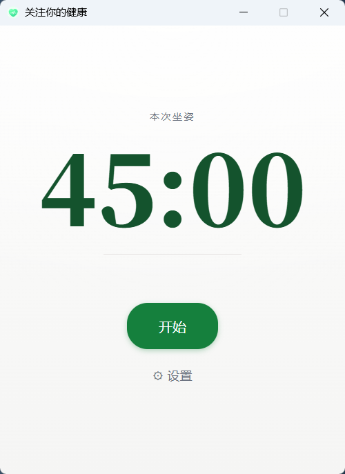

# Your Health — 久坐提醒

一个基于 Tauri 2.x + Vue 3 + TypeScript 的桌面健康软件 MVP，久坐闹钟提醒。

<table>
  <tr>
    <td align="center"><b>首页</b></td>
    <td align="center"><b>到时提醒</b></td>
  </tr>
  <tr>
    <td></td>
    <td></td>
  </tr>
</table>


## 功能

- 可配置提醒时长(30/45/60/90 分钟,默认 45)
- 5 个内置铃声
- 开始 / 中断 / 结束 三按钮
- 圆环倒计时可视化
- 强提醒:时间到 → 全屏弹窗 + 循环铃声
- 设置自动持久化

## 技术栈

Tauri 2.x · Vue 3 · TypeScript · Pinia · vue-router · Vitest

## 开发

```bash
npm install
npm run tauri dev      # 开发模式
npm run test           # 单元 + 组件测试
npm run test:rust      # Rust 单元测试
npm run build          # 前端构建
npm run tauri build    # 打包桌面应用
```

## E2E 测试

需要先启动 Tauri 应用:

```bash
# Terminal 1
npm run tauri dev

# Terminal 2
npm run test:e2e
```

## 系统要求

- Node.js 18+
- Rust 1.70+
- Windows: WebView2 Runtime(Win11 自带,Win10 需手动安装)
- macOS: 无额外要求
- Linux: webkit2gtk

## 目录结构

参见 `docs/superpowers/specs/2026-07-29-sedentary-reminder-design.md` §4。

## 设计文档

- [设计文档](docs/superpowers/specs/2026-07-29-sedentary-reminder-design.md)
- [实施计划](docs/superpowers/plans/2026-07-29-sedentary-reminder.md)

## 已知限制(MVP)

- 不留提醒历史
- 不支持自定义铃声
- 不支持开机自启
- 不支持 macOS / Linux 验证(开发机为 Windows)
